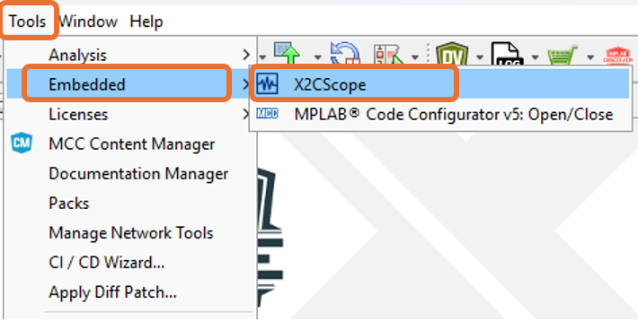
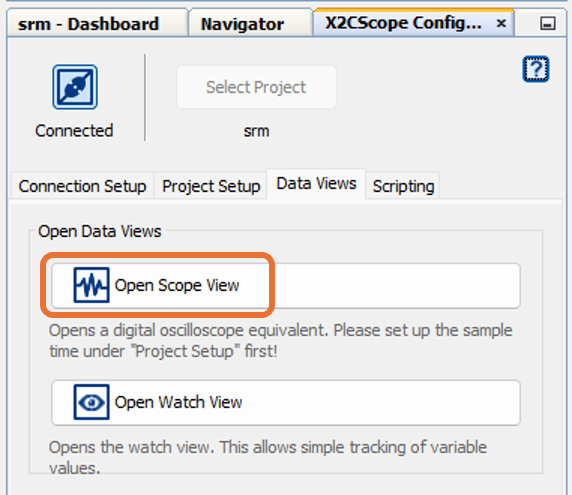

 
## Speed control of Switched Reluctance Motor (SRM) using dsPIC33AK128MC106 

## 1. INTRODUCTION
This document describes the setup requirements for driving a Switched Reluctance Motor (SRM) using dsPIC33AK128MC106.

For details about the speed control of SRM, refer to Microchip product brief “Switched Reluctance Motor Control Solution".
 

## 2. SUGGESTED DEMONSTRATION REQUIREMENTS

### 2.1 Motor Control Application Firmware Required for the Demonstration

To clone or download this application firmware on GitHub, 
- Navigate to the [main page of this repository](https://github.com/microchip-pic-avr-solutions/hv-33ak128mc106-srm-sensored-speed-control) and 
- On the tab **<> Code**, above the list of files in the right-hand corner, click Code, then from the menu, click **Download ZIP** or copy the repository URL to **clone.**
> **Note:**  
>In this document, hereinafter this firmware package is referred as **firmware.**
### 2.2 Software Tools Used for Testing the firmware

- MPLAB® X IDE **v6.20** 
- Device Family Pack (DFP): **dsPIC33AK-MC_DFP v1.0.33**
- Curiosity/Starter Kits Tool Pack : **PKOB4_TP v1.18.1438**
- MPLAB® XC-DSC Compiler **v3.20**
- MPLAB® X IDE Plugin: **X2C-Scope v1.7.0** 
> **Note:**  
>The software used for testing the firmware prior to release is listed above. It is recommended to use these or later versions of the tool for building the firmware. All previous versions of Device Family Packs (DFP) and Tool Packs can be downloaded from [Microchip Packs Repository.](https://packs.download.microchip.com/)
### 2.3 Hardware Tools Required for the Demonstration
- MCHV-SRM Development Platform
- 350V, 4 phase, 8/6 pole SRM.
- dsPIC33AK128MC106 Motor Control Dual In-line Module (DIM) [(EV68M17A)](https://www.microchip.com/en-us/development-tool/ev68m17a)

> **Note:**  
> - MCHV-SRM Development Platform is currently not avaliable for purchase (contact Microchip sales representative for support).
> - The SRM used here is a custom built motor, however one can implement this philosophy for other similar SRMs
> - EV68M17A is available at [microchip DIRECT](https://www.microchipdirect.com/)
 

## 3. HARDWARE SETUP
This section describes the hardware setup required for the demonstration.

1. Motor currents are amplified on the MCHV-SRM Development Platform. The firware requires DIM to be configured for external amplifier outputs  (**'external op-amp configuration'**) to measure the motor currents. **Table-1** summarizes the resistors to be populated and removed to convert the DIM from **‘internal op-amp configuration’** to **‘external op-amp configuration’**.

     

     

2. Ensure the development board is not powered and it is fully discharged. Verify the LEDs **LD1** (Green) on Power Supply Board, **LD1** (Green) on Inverter Board and **LD4** (Green) on Control Board are not glowing.

     

     

3.  Insert the **dsPIC33AK128MC106 Motor Control DIM** into the DIM Interface **connector J2** on the control board. Make sure the DIM is placed correctly and oriented before going ahead. 

     

     

4. Connect the 4-phase wires from the motor to **A**, **B**, **C**, and **D** of the connector J1, J2, J3 and J4 respectively (**MOTOR**) on the inverter board.

     

      

5. Connect the rotor position sensor interface to the control board (for this application AM4096 magnetic encoder is used to detect the rotor position).

6. Power the development board from a controlled AC source by applying voltage of 220 Vac rms through IEC connector **connector J1** provided on the Power board.

     

      

 
     > **Note:**  
     >This Board is designed to operate in the 75 to 280 Vac rms voltage range with a maximum input current of 10Arms. 

 7. The development board has an isolated on-board programming tool called the Isolated PKoB4 Daughter Board. To use the isolated on-board programmer, connect a micro-USB cable between the Host PC and the connector J14 (**PROGRAM**) on the control board.
      

     

     > **Note:**  
     > Use only **shielded micro-USB** cables intended for data transfer.

 8. To establish serial communication with the host PC, connect a micro-USB cable between the host PC and the connector J11 (**USB-UART**) on the development board. This interface provides an isolated USB-UART communication.
      

      

     > **Note:**  
     > Use only **shielded micro-USB** cables intended for data transfer.
  

## 4. SOFTWARE SETUP AND RUN
### 4.1 Setup: MPLAB X IDE and MPLAB XC-DSC Compiler
Install **MPLAB X IDE** and **MPLAB XC-DSC Compiler** versions that support the device **dsPIC33AK128MC106** and **PKoBv4.** The MPLAB X IDE, MPLAB XC-DSC Compiler, and X2C-Scope plug-in used for testing the firmware are mentioned in the [Motor Control Application Firmware Required for the Demonstration](#21-motor-control-application-firmware-required-for-the-demonstration) section. 

To get help on  

- MPLAB X IDE installation, refer the [link](https://microchipdeveloper.com/mplabx:installation)
- MPLAB XC-DSC Compiler installation steps, refer the [link](https://developerhelp.microchip.com/xwiki/bin/view/software-tools/xc-dsc/install/)

If MPLAB IDE v8 or earlier is already installed on your computer, then run the MPLAB driver switcher (Installed when MPLAB®X IDE is installed) to switch from MPLAB IDE v8 drivers to MPLAB X IDE drivers. If you have Windows 8 or 10, you must run the MPLAB driver switcher in **Administrator Mode**. To run the Device Driver Switcher GUI application as administrator, right-click on the executable (or desktop icon) and select **Run as Administrator**. For more details, refer to the MPLAB X IDE help topic **“Before You Begin: Install the USB Device Drivers (For Hardware Tools): USB Driver Installation for Windows Operating Systems.”**

### 4.2 Setup: X2C-SCOPE
X2C-Scope is a MPLAB X IDE plugin that allows developers to interact with an application while it runs. X2C-Scope enables you to read, write, and plot global variables (for motor control) in real-time. It communicates with the target using the UART. To use X2C-Scope, the plugin must be installed. To set up and use X2C-Scope, refer to the instructions provided on the [web page](https://x2cscope.github.io/docs/MPLABX_Plugin.html).

## 5.  BASIC DEMONSTRATION
### 5.1 Firmware Description
The firmware version needed for the demonstration is mentioned in the section [Motor Control Application Firmware Required for the Demonstration](#21-motor-control-application-firmware-required-for-the-demonstration) section. This firmware is implemented to work on Microchip’s Digital signal controller (dsPIC® DSC) **dsPIC33AK128MC106**. For more information, see the **dsPIC33AK128MC106 Family datasheet [(DS70005539)](https://ww1.microchip.com/downloads/aemDocuments/documents/MCU16/ProductDocuments/DataSheets/dsPIC33AK128MC106-Family-Data-Sheet-DS70005539.pdf)**.

The Motor Control Demo application uses a push button to start or stop the motor and a potentiometer to vary the speed of the motor. This Motor Control Demo Application configures and uses peripherals like PWM, ADC, UART, etc. 

> **Note:** 
> The project may not build correctly in Windows OS if the Maximum path length of any source file in the project is more than 260 characters. In case the absolute path exceeds or nears the maximum length, do any (or both) of the following:
> - Shorten the directory name containing the firmware used in this demonstration. If you renamed the directory, consider the new name while reading the instructions provided in the upcoming sections of the document.
> - Place firmware in a location such that the total path length of each file included in the projects does not exceed the Maximum Path length specified.  
> Refer to MPLAB X IDE help topic **“Path, File, and Folder Name Restrictions”** for details. 

### 5.2 Basic Demonstration
Follow the below instructions, step by step, to set up and run the motor control demo application:

1. Start **MPLAB X IDE** and open the project **srm.X (File > Open Project)** with device selection **dsPIC33AK128MC106.**  
    

       

  

2. Set the project **srm.X** as the main project by right-clicking on the project name and selecting **Set as Main Project** as shown. The project **srm.X** will then appear in **bold.**
    

     

 

	
3. Open <code>**mc1_user_parms.h** </code> (**srm.X > Header Files**) in the project **srm.X.**  
     - Ensure that the macros <code>**SPEED_CONTROL**</code> is defined for speed loop functioning and undefined for current loop functioning in the header file<code> **mc1_user_parms.h.**</code>
          

     - The macro <code>**ALLEGRO_CT110_CS**</code> is defined for magnetic sensor based current measurement. 
          
 
 
          Also, the changes to 0R jumper resistors should be done for source of current measurement in the inveter board as shown in the table below
           
 

4. Right-click on the project **srm.X** and select **Properties** to open its **Project Properties** Dialog. Click the **Conf:[default]** category to reveal the general project configuration information. The development tools used for testing the firmware are listed in section [2.2 Software Tools Used for Testing the firmware.](#22-software-tools-used-for-testing-the-firmware)

     In the **Conf:[default]** category window: 
     - Ensure the selected **Device** is **dsPIC33AK128MC106.**
     - Select the **Connected Hardware Tool** to be used for programming and debugging. 
     - Select the specific Device Family Pack (DFP) from the available list of **Packs.** In this case, **dsPIC33AK-MC_DFP 1.0.33** is selected. 
     - Select the specific **Compiler Toolchain** from the available list of **XC-DSC** compilers. 
     In this case, **XC-DSC(v3.20)** is selected.
     - After selecting Hardware Tool and Compiler Toolchain, Device Pack, click the button **Apply**

     Please ensure that the selected MPLAB® XC-DSC Compiler and Device Pack support the device configured in the firmware

     

     

5. Ensure that the checkbox **Load symbols when programming or building for production (slows process)** is checked under the **Loading** category of the **Project Properties** window.       
        
      

      

     Also, go to **Tools > Options** , and
           
      

      

      
    Open the  **Embedded > Generic Settings** tab and ensure that the **ELF debug session symbol load methodology (MIPS/ARM)** is selected as **Pre-procesed (Legacy)** from the drop down.
           
      

      

6. To build the project (in this case, **pmsm.X**) and program the device dsPIC33AK128MC106, click **Make and Program Device Main project** on the toolbar
    

    

  
7. If the device is successfully programmed, **LED1 (D11)** will be turned **ON**, indicating that the dsPIC® DSC is enabled.
    

     

8. Run or stop the motor by pressing the push button **BUTTON 1**. The motor should start spinning smoothly in one direction. The **LED2 (D12)** is turned **ON** to show the button is pressed to start the motor.
     

     

 

9. The motor speed can be varied using the potentiometer **(POT).**
    

    

10. Press the push button **BUTTON 2** to change the direction of rotation.
    

    

11. Press the push button **BUTTON 1** to stop the motor.

>**Note:** 
>In the header file <code>**mc1_user_parms.h**</code> included in the project **srm.X.**
> - The macros <code>RATED_CURRENT</code>, <code>MINIMUM_SPEED_RPM</code>, <code>NOMINAL_SPEED_RPM</code>, <code>MAXIMUM_SPEED_RPM</code>, <code>MOTOR_MIN_DC_VOLT</code>,  and <code>MOTOR_MAX_DC_VOLT</code> are defined as per the Motor manufacturer’s specifications. Exceeding manufacture specifications may damage the motor or the board or both. 
> - In this firmware commutation of phases is defined in the macro  <code>THETA_X_COMMUTATE_CW</code>, the turn-on and turn-off angles should be defined in the macros <code>THETA_X_ON_CW</code> and <code>THETA_X_OFF_CW</code> respectively. The bootstrap capacitor to be charged should be defined in the macro <code>THETA_X_CBOOT_CW</code>. Here "X" is the number of phases, also there are diffrent marcos defined for clockwise and counter clockwise direction of rotation. 
> - The marco <code>PHASE_OC_THRESHOLD</code> is defined as a threshold for software phase over current fault detection.

## 5.3  Data visualization through X2C-Scope Plug-in of MPLAB X

X2C-Scope is a third-party plug-in in MPLAB X, which helps in real-time diagnostics. The application firmware comes with the initialization needed to interface the controller with the host PC to enable data visualization through the X2C-Scope plug-in. Ensure the X2C-Scope plug-in is installed. For more information on how to set up a plug-in, refer to either the [Microchip Developer Help page](https://microchipdeveloper.com/mplabx:tools-plugins-available) or the [web page.](https://x2cscope.github.io/docs/MPLABX_Plugin.html)
 
1. To establish serial communication with the host PC, connect a micro-USB cable between the host PC and connector J11 **(USB-UART)** on the development board. This interface provides an isolated USB-UART communication.

2. Ensure the application is configured and running as described under section [5.2 Basic Demonstration](#52-basic-demonstration) by following steps 1 through 11.

3. Open the **X2C-Scope** window by selecting **Tools>Embedded>X2CScope.**
      

       

 

4. **In the X2C-Scope Configuration** window, open the **Connection Setup** tab and click **Select Project.** This opens the drop-down menu **Select Project** with a list of opened projects. Select the specific project **srm** from the list of projects and click **OK.**
    

    

5. To configure and establish the serial communication for **X2C-Scope**, open the **X2CScope Configuration** window, click on the **Connection Setup** tab and:
     - Set **Baudrate** as **115200**, which is configured in the application firmware. 
     - Click on the **Refresh** button to refresh and update the list of the available Serial COM ports connected to the Host PC. 
     - Select the specific **Serial port** detected when interfaced with the development board. The **Serial port** depends on the system settings

    

     

 

6. Once the **Serial port** is detected, click on **Disconnected** and turn to **Connected**, to establish serial communication between the Host PC and the board.
     

    

7. Open the **Project Setup** tab in the **X2CScope Configuration** window and,
     - Set **Scope Sampletime** as the interval at which <code>X2CScopeUpdate()</code> is called. In this application, it is every <code>50µs.</code> 
     - Then, click **Set Values** to save the configuration.

      

      

8.	Click on **Open Scope View** (in the **Data Views** tab of the **X2CScope Configuration** Window); this opens **Scope Window.**
     

      

    	     
9. In the **Scope Window**, select the variables that must be watched. To do this, click on the **Source** against each channel, and a window **Select Variables** opens on the screen. From the available list, the required variable can be chosen. Ensure checkboxes **Enable** and **Visible** are checked for the variables to be plotted.
To view data plots continuously, uncheck **Single-shot.** When **Single-shot** is checked, it captures the data once and stops. The **Sample time factor** value multiplied by **Sample time** decides the time difference between any two consecutive data points on the plot.
    

    

10.	Click on **SAMPLE**, then the X2C-Scope window plots variables in real-time, which updates automatically.
     

     

 

11.	Click on **ABORT** to stop.
     

     

 
 ## 6. REFERENCES:
For additional information, refer following documents or links.
1. dsPIC33AK128MC106 Motor Control Dual In-Line Module (DIM) Information Sheet [(DS70005527)](https://ww1.microchip.com/downloads/aemDocuments/documents/MCU16/ProductDocuments/InformationSheet/dsPIC33AK128MC106-Motor-Control-Dual-In-Line-Module-DIM-Information-Sheet-DS70005527.pdf)
2. dsPIC33AK128MC106 Family datasheet [(DS70005539)](https://ww1.microchip.com/downloads/aemDocuments/documents/MCU16/ProductDocuments/DataSheets/dsPIC33AK128MC106-Family-Data-Sheet-DS70005539.pdf)
3. MPLAB® X IDE User’s Guide [(DS50002027)](https://ww1.microchip.com/downloads/en/DeviceDoc/50002027E.pdf) or [MPLAB® X IDE help](https://microchipdeveloper.com/xwiki/bin/view/software-tools/x/)
4. [MPLAB® X IDE installation](http://microchipdeveloper.com/mplabx:installation)
5. [MPLAB® XC-DSC Compiler installation](https://developerhelp.microchip.com/xwiki/bin/view/software-tools/xc-dsc/install/)
6. [Installation and setup of X2Cscope plugin for MPLAB X](https://x2cscope.github.io/docs/MPLABX_Plugin.html)
7. [Microchip Packs Repository](https://packs.download.microchip.com/)
8. [Programming and Debugging the dsPIC33A on MPLAB X IDE v6.20 and IPE v6.20](https://developerhelp.microchip.com/xwiki/bin/view/software-tools/ides/x/)

